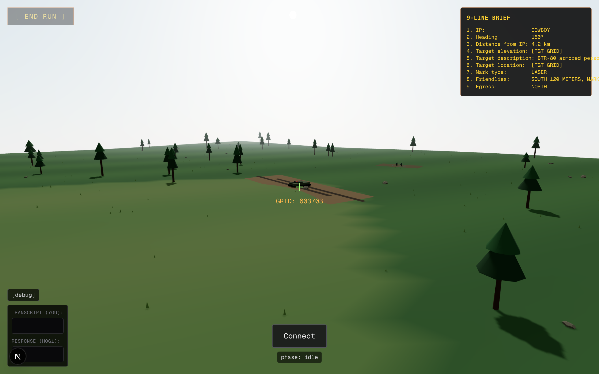
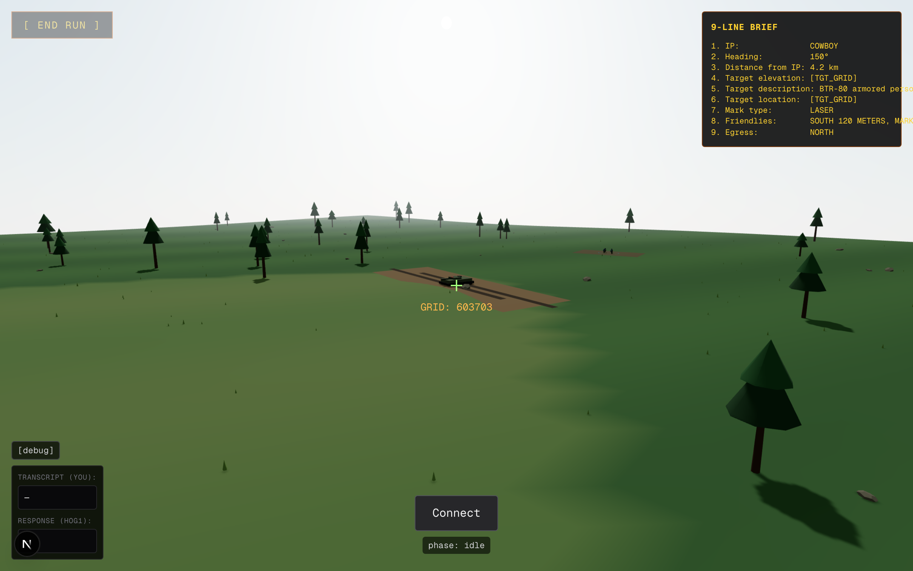
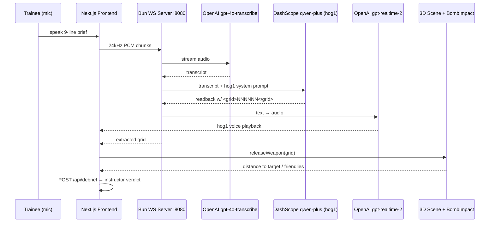

# JTAC Trainer

> Close air support voice-procedure simulator for terminal attack control trainees.

**Hackathon track:** best use of `gpt-realtime-2`
**Event:** AIE Open Canvas Hackathon — [luma.com/aie-hack](https://luma.com/aie-hack)

## What it does

Real-time voice procedure sim for CAS (close air support) trainees. The trainee surveys a 3D battlefield, speaks a 9-line CAS brief to **hog1** — an A-10 pilot agent — and watches the bomb land wherever the transmission said it should. **Misread a grid? You get a visible, consequential miss.** End the run for an instructor-style debrief.

## Who it helps

Air control and CAS voice procedures are critical — they decide life-or-death situations. But realistic training is expensive: live-fire ranges, real aircraft, and instructor time are all bottlenecks. A voice agent removes that bottleneck so trainees can drill scenarios and manoeuvres on demand, no instructor or jet required.

## Demo

The 3D scene with HUD (9-line brief, reticle, debug panel):



Connect to the pilot to start a run:



The core loop — wrong grid in transmission ⇒ bomb lands offset from target (orange impact ring + crater shown):


## Data flow



## Quick start

```bash
# 1. ws-server (Bun, port 8080)
cd ws-server
bun install
OPENAI_API_KEY=... DASHSCOPE_API_KEY=... bun src/index.ts

# 2. frontend (Next.js, port 3000)
bun install
bun dev
```

Open <http://localhost:3000> in **Chrome desktop** (Safari mic permissions are flaky).

Optional voice overrides: `OPENAI_TRANSCRIBE_MODEL`, `OPENAI_REALTIME_VOICE_MODEL`, `OPENAI_REALTIME_VOICE`, `OPENAI_REALTIME_VOICE_ID`, `MIN_TRANSCRIPT_WORDS`.

## Stack

- **Frontend:** Next.js 16 (App Router) + react-three-fiber + Tailwind v4 + Zustand
- **Voice in:** OpenAI `gpt-4o-transcribe` (24kHz PCM)
- **Brain:** Alibaba DashScope `qwen-plus` — emits a hidden `<grid>NNNNNN</grid>` in the readback that the WS server extracts
- **Voice out:** OpenAI `gpt-realtime-2`
- **Transport:** Bun WebSocket server on `:8080`
- **Deploy:** Vercel (frontend) → ECS (ws-server) at `wss://ws.kalebnim.dev/ws`

## Repo layout

```
src/app/        Next.js routes (page.tsx, api/debrief)
src/scene/      Three.js scene (Scene.tsx, BombImpact.tsx, Terrain.tsx)
src/components/ TalkButton, Reticle, ScenarioCard, DebriefPanel, ...
src/hooks/      useRealtimeVoice (mic → WS pipeline)
src/lib/        store (Zustand), grid (MGRS), positions, verdict (≤30m solid, ≤75m unsafe)
prompts/        system-prompt.md (hog1 persona + 9-line discipline)
ws-server/      Bun WS server: STT + LLM + TTS bridge
scripts/        capture-screenshots.ts (Playwright, regenerates docs/screenshots/)
```

## Regenerating the demo screenshots

The screenshots above are produced by a Playwright script that drives the dev-mode `window.__releaseWeapon` hook directly — no real mic, no ws-server required:

```bash
bun dev                                # in one terminal
bun scripts/capture-screenshots.ts     # in another
```

Output writes to `docs/screenshots/`. The airstrike shot uses grid `599799` (the friendly-killer from `bomb-smoke.ts`) so the impact lands offset from the target — that's the wrong-grid → wrong-impact loop in one frame.

## Why "vibes-based" debrief?

6-hour sprint. Per-line 9-line JSON parsing eats the budget for marginal demo lift. The bomb-impact outcome is the objective signal; the LLM debrief reads it and writes prose like an instructor would. See `.claude/plans/entering-the-aie-open-enumerated-bentley.md`.
